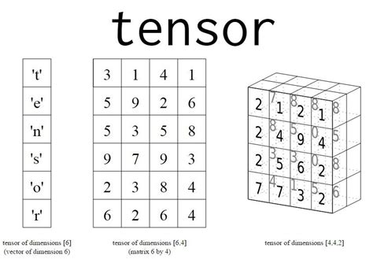
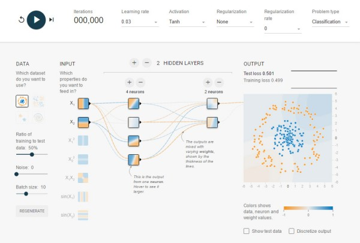

# Academy-Course-DAT31071

**An Introduction to Tensor Operations with Eigen**

This course is a Open Risk Academy DeepDive into using the Eigen C++ Library to perform **Tensor** calculations.

## What is Eigen::Tensor?

Eigen is a C++ template library for linear algebra covering matrices, vectors, numerical solvers, and related
algorithms. We focus in this course on a significant extension of Eigen (the Tensor module) that extends Eigen's
functionality in handling *higher-dimensional numerical objects* (tensors of three and higher dimensions).

## Motivation for the Course

Eigen (and in particular its Tensor module) is a building block used by major open source computational libraries and
frameworks such a Tensorflow and Stan. Such libraries frequently require tensor type containers (higher-dimensional than
vectors and matrices). Familiarity with the Eigen::Tensor API enables developers with similar requirements to write
concise, high-level C++ code that is performant on a variety of devices.

## Course Objectives

The objective of the course is to provide an introduction to using Eigen::Tensor as a high-level library for using
Tensors in C++ projects.

* We learn the concept and techniques of the Eigen Tensor class
* How to declare, initialize Tensors of various ranks and types and how to access Tensor elements
* Elementary unary and binary operations involving Tensors
* More complex operations (reductions, contractions)
* Modifying the shape of Tensors

The course is live at the [Open Risk Academy](https://www.openriskacademy.com), this repository
hosts C++ scripts used in the course.

## Pre-requisites

Basic knowledge and a working setup for C++ development (e.g., being able to add Eigen as a header only library) is
required.

Mathematical notation is used liberally throughout the course to clarify (for those familiar with it) the tensor
manipulation concepts but is not strictly required for benefiting from the course.

## Summary of Contents

The course comprises 14 Steps covering the following topics

* Step 1. Getting started with Eigen
    * 1.1 Find Installed Eigen Version
* Step 2. Tensor Class Declarations
    * 2.1 Tensor Classes (Datatypes)
    * 2.2 Tensor Dimensions
    * 2.3 Element Access
* Step 3. Tensor Class Initializations
    * 3.1 Initialization with Values
    * 3.2 Tensor Symmetries
    * 3.3 Set Raw Tensor Data
    * 3.4 Setting Values
* Step 4. Working with Tensor Elements, I
    * 4.1 Accessing Tensor Values
    * 4.2 Reshape Tensor
    * 4.3 Printing Values
* Step 5. Working with Tensor Elements, II
    * 5.1 Tensor Arithmetic
    * 5.2 Tensor Resizing
    * 5.3 Casting Datatypes
* Step 6. Random Number Initialization
    * 6.1 Generating Random Numbers
    * 6.2 Fixing the Seed
    * 6.3 Custom Generators
* Step 7. Unary Element-Wise Operations
    * 7.1 The Minus Operator
    * 7.2 Unary Operations
    * 7.3 Check Operations
    * 7.4 ArgMax Operator
* Step 8. Binary Element-Wise Operations
    * 8.1 Binary Arithmetic
    * 8.2 Logical Operations
    * 8.3 Logical Reductions
    * 8.4 Tensor Value Selections
* Step 9. In-Memory Representations of Tensors
* Step 10. Tensor Contraction Operations
    * 10.1 Tensor Contraction
    * 10.2 Double Contraction
    * 10.2 Chained Contractions
* Step 11. Tensor Reduction Operations
    * 11.1 Tensor Reductions
    * 11.2 Tensor Trace Operation
* Step 12. Tensor Shape Modifying Operations
    * 12.1 Shuffle Tensors
    * 12.2 Chip Operations
    * 12.3 Slice Operations
    * 12.4 Stride Operations
    * 12.5 Reverse
    * 12.6 Broadcast Operations
    * 12.7 Concatenate Tensors
    * 12.8 Padding Operations
    * 12.9 Extract Patch
* Step 13. Tensor Scanning Operations
    * 13.1 Cumulative Sum
    * 13.2 Cumulative Product
* Step 14. Review and Outlook

## Course Exercises

The exercises involve writing C++ small snippets of code that accomplish a certain task. The suggest form for each
exercise solution is as a *Catch2 Test*.

Indicative solutions to exercises are provided in this repository.

